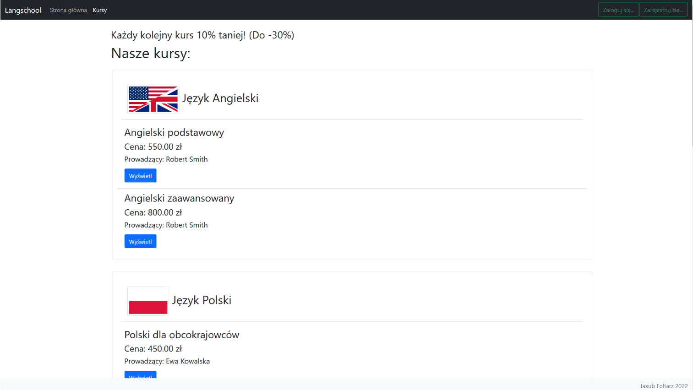

# Langschool-app

Language learning school MVC web app that allows users to browse and enroll onto courses, and manage them.

Written in PHP using the Laravel Web Framework.

Uses Bootstrap CSS and a MySQL database.

Made for a university project.

## Screenshots

Homepage

Courses page

Courses page (logged in teacher)

User's courses

Teacher panel

Users panel (administrator)

#
# Langschool-app

Aplikacja webowa MVC szkoły językowej, która pozwala użytkownikom przeglądać i zapisywać się na kursy oraz zarządzać nimi.

Napisana w PHP przy użyciu frameworka Laravel.

Używa CSS Bootstrap i bazy danych MySQL.

Stworzona na potrzeby projektu na studiach.

## Zrzuty ekranu

Strona główna

Strona kursów

Strona kursów (zalogowany nauczyciel)

Kursy użytkownika

Panel nauczyciela

Panel użytkowników (administrator)

